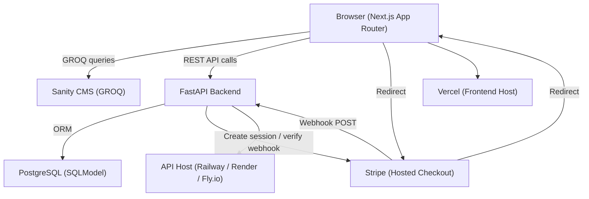

# Design Document — Luxury Jewelry E-Commerce

## Overview

This document defines the full technical and visual design for a premium luxury jewelry e-commerce platform. The system is a dual-app monorepo: a Next.js 14 App Router frontend deployed to Vercel, and a Python FastAPI backend deployed as a standalone service. Sanity is the CMS for all editorial and product content. PostgreSQL (via SQLModel) handles all transactional data. Stripe powers payments via hosted Checkout Sessions.

The aesthetic is quiet luxury — ivory, champagne, charcoal, muted gold. Editorial, spacious, product-first. No SaaS grids, no glassmorphism, no loud motion.

---

## Architecture



### Key Architectural Decisions

- Next.js server components fetch Sanity content at build/request time — no client-side CMS calls for product/collection pages.
- Cart state lives in Zustand (client) + localStorage for guests; synced to FastAPI for authenticated users.
- Wishlist follows the same guest/auth split.
- FastAPI is stateless; all state lives in PostgreSQL or Stripe.
- Stripe Checkout is hosted (not Elements) to minimize PCI scope.
- Webhook signature verification is mandatory before any order mutation.

---

## Components and Interfaces

### Layout Components

| Component | Purpose |
|---|---|
| `RootLayout` | App shell, font loading, providers |
| `SiteHeader` | Top nav, logo, icon actions |
| `SiteFooter` | Links, policies, social, tagline |
| `PageContainer` | Max-width wrapper with horizontal padding |
| `Section` | Vertical rhythm wrapper with configurable spacing |

### Navigation Components

| Component | Purpose |
|---|---|
| `NavDesktop` | Horizontal nav links with hover states |
| `NavMobile` | Hamburger + full-screen drawer |
| `CartDrawer` | Slide-in cart panel (Radix Sheet) |
| `SearchOverlay` | Full-width search modal |
| `NavIconGroup` | Search, Account, Wishlist, Cart icons |

### Commerce Components

| Component | Purpose |
|---|---|
| `ProductCard` | Image, name, price, wishlist toggle, hover swap |
| `ProductGrid` | Responsive grid wrapper |
| `ProductGallery` | Main image + thumbnail strip (desktop) / swipe carousel (mobile) |
| `ProductOptions` | Size/metal/stone selector buttons |
| `AddToCartButton` | Validates stock, triggers cart add |
| `StickyCartBar` | Mobile-only fixed bottom bar |
| `CartItem` | Line item in drawer with qty controls |
| `CartSummary` | Subtotal + checkout CTA |
| `WishlistButton` | Heart toggle, syncs to store |
| `PriceDisplay` | Formatted price with currency |
| `BadgeNew` / `BadgeSale` | Product badges |

### Content Components

| Component | Purpose |
|---|---|
| `HeroSection` | Full-viewport editorial hero |
| `CategoryTile` | Image + label with hover transition |
| `SignatureItem` | Editorial product feature card |
| `CampaignBanner` | Full-width promo image + CTA |
| `BrandStory` | Split layout: image + copy |
| `NewsletterCapture` | Email form with brand headline |
| `CollectionHero` | Collection page banner |
| `EditorialAccordion` | Collapsible content (materials, shipping) |
| `RelatedProducts` | Horizontal scroll of related pieces |
| `PolicyContent` | Rendered Sanity portable text |

### Form Components

| Component | Purpose |
|---|---|
| `EmailInput` | Styled email field |
| `QuantitySelector` | +/- stepper |
| `FilterDrawer` | Mobile slide-up filter panel |
| `SortSelect` | Dropdown sort control |
| `CouponInput` | Promo code field + apply button |

### Feedback Components

| Component | Purpose |
|---|---|
| `LoadingSkeleton` | Shimmer placeholder for product cards |
| `Toast` | Radix Toast for cart/wishlist confirmations |
| `EmptyState` | Elegant empty cart/wishlist state |
| `ErrorBoundary` | Graceful error fallback |

---

## Data Models

### Sanity Schemas

#### `product`
```ts
{
  _id: string
  _type: 'product'
  title: string
  slug: { current: string }
  price: number
  compareAtPrice?: number
  images: SanityImage[]          // first image = primary, second = hover swap
  category: Reference<category>
  collection: Reference<collection>
  materials: string[]
  options: ProductOption[]       // [{ name: 'Metal', values: ['18k Gold', 'Silver'] }]
  description: PortableText
  craftsmanship: PortableText
  isNew: boolean
  isFeatured: boolean
  inStock: boolean
  sku: string
}
```

#### `category`
```ts
{
  _id: string
  _type: 'category'
  title: string                  // Rings, Necklaces, Earrings, Bracelets
  slug: { current: string }
  image: SanityImage
}
```

#### `collection`
```ts
{
  _id: string
  _type: 'collection'
  title: string
  slug: { current: string }
  heroImage: SanityImage
  description: string
  products: Reference<product>[]
}
```

#### `homepageSettings`
```ts
{
  _id: 'homepageSettings'
  _type: 'homepageSettings'
  hero: { headline: string, subline: string, ctaLabel: string, ctaHref: string, image: SanityImage }
  featuredCategories: Reference<category>[]
  signatureProducts: Reference<product>[]
  campaignBanner: { image: SanityImage, headline: string, ctaLabel: string, ctaHref: string }
  featuredProducts: Reference<product>[]
  brandStory: { image: SanityImage, headline: string, body: PortableText }
  newsletterHeadline: string
}
```

#### `policy`
```ts
{
  _id: string
  _type: 'policy'
  title: string
  slug: { current: string }
  body: PortableText
}
```

#### `editorialQuote`
```ts
{
  _id: string
  _type: 'editorialQuote'
  quote: string
  attribution?: string
}
```

### PostgreSQL Tables (SQLModel)

#### `users`
```sql
id          UUID PRIMARY KEY DEFAULT gen_random_uuid()
email       TEXT UNIQUE NOT NULL
name        TEXT
created_at  TIMESTAMPTZ DEFAULT now()
```

#### `carts`
```sql
id          UUID PRIMARY KEY DEFAULT gen_random_uuid()
user_id     UUID REFERENCES users(id) NULLABLE   -- null = guest
session_id  TEXT                                  -- guest identifier
created_at  TIMESTAMPTZ DEFAULT now()
updated_at  TIMESTAMPTZ DEFAULT now()
```

#### `cart_items`
```sql
id          UUID PRIMARY KEY DEFAULT gen_random_uuid()
cart_id     UUID REFERENCES carts(id) ON DELETE CASCADE
product_sku TEXT NOT NULL                          -- source of truth: Sanity slug/sku
variant_key TEXT                                   -- e.g. "18k-gold-size-6"
quantity    INT NOT NULL DEFAULT 1
unit_price  NUMERIC(10,2) NOT NULL                 -- snapshotted at add time
```

#### `orders`
```sql
id                UUID PRIMARY KEY DEFAULT gen_random_uuid()
user_id           UUID REFERENCES users(id) NULLABLE
stripe_session_id TEXT UNIQUE NOT NULL
status            TEXT NOT NULL DEFAULT 'pending'  -- pending | paid | fulfilled | cancelled
total_amount      NUMERIC(10,2) NOT NULL
currency          TEXT NOT NULL DEFAULT 'usd'
shipping_address  JSONB
created_at        TIMESTAMPTZ DEFAULT now()
updated_at        TIMESTAMPTZ DEFAULT now()
```

#### `order_items`
```sql
id           UUID PRIMARY KEY DEFAULT gen_random_uuid()
order_id     UUID REFERENCES orders(id) ON DELETE CASCADE
product_sku  TEXT NOT NULL
variant_key  TEXT
quantity     INT NOT NULL
unit_price   NUMERIC(10,2) NOT NULL
product_name TEXT NOT NULL                         -- snapshotted
```

#### `payments`
```sql
id                  UUID PRIMARY KEY DEFAULT gen_random_uuid()
order_id            UUID REFERENCES orders(id)
stripe_payment_id   TEXT UNIQUE
amount              NUMERIC(10,2)
status              TEXT                           -- succeeded | failed | refunded
created_at          TIMESTAMPTZ DEFAULT now()
```

#### `coupons`
```sql
id              UUID PRIMARY KEY DEFAULT gen_random_uuid()
code            TEXT UNIQUE NOT NULL
discount_type   TEXT NOT NULL                      -- percent | fixed
discount_value  NUMERIC(10,2) NOT NULL
max_uses        INT
uses_count      INT DEFAULT 0
expires_at      TIMESTAMPTZ
active          BOOLEAN DEFAULT true
```

#### `newsletter_signups`
```sql
id          UUID PRIMARY KEY DEFAULT gen_random_uuid()
email       TEXT UNIQUE NOT NULL
created_at  TIMESTAMPTZ DEFAULT now()
```

#### `wishlists`
```sql
id          UUID PRIMARY KEY DEFAULT gen_random_uuid()
user_id     UUID REFERENCES users(id) ON DELETE CASCADE
created_at  TIMESTAMPTZ DEFAULT now()
```

#### `wishlist_items`
```sql
id           UUID PRIMARY KEY DEFAULT gen_random_uuid()
wishlist_id  UUID REFERENCES wishlists(id) ON DELETE CASCADE
product_sku  TEXT NOT NULL
added_at     TIMESTAMPTZ DEFAULT now()
```

#### `webhook_events`
```sql
id              UUID PRIMARY KEY DEFAULT gen_random_uuid()
stripe_event_id TEXT UNIQUE NOT NULL
event_type      TEXT NOT NULL
processed       BOOLEAN DEFAULT false
payload         JSONB
received_at     TIMESTAMPTZ DEFAULT now()
```

---

## Design System

### Color Tokens
```ts
// tailwind.config.ts
colors: {
  ivory:      '#FDFAF5',
  cream:      '#F5F0E8',
  champagne:  '#E8D9C0',
  sand:       '#C9B99A',
  taupe:      '#8C7B6B',
  charcoal:   '#2C2C2C',
  gold:       '#B8975A',
  'gold-light': '#D4B483',
  white:      '#FFFFFF',
  black:      '#1A1A1A',
}
```

### Typography Scale
```ts
fontFamily: {
  serif: ['Cormorant Garamond', 'Georgia', 'serif'],
  sans:  ['DM Sans', 'Inter', 'sans-serif'],
}
fontSize: {
  'display-xl': ['4.5rem', { lineHeight: '1.1', letterSpacing: '-0.02em' }],
  'display-lg': ['3.5rem', { lineHeight: '1.15', letterSpacing: '-0.02em' }],
  'display-md': ['2.5rem', { lineHeight: '1.2', letterSpacing: '-0.01em' }],
  'heading-lg': ['2rem',   { lineHeight: '1.25' }],
  'heading-md': ['1.5rem', { lineHeight: '1.3' }],
  'heading-sm': ['1.25rem',{ lineHeight: '1.4' }],
  'body-lg':    ['1.125rem',{ lineHeight: '1.7' }],
  'body-md':    ['1rem',   { lineHeight: '1.7' }],
  'body-sm':    ['0.875rem',{ lineHeight: '1.6' }],
  'label':      ['0.75rem',{ lineHeight: '1.5', letterSpacing: '0.1em' }],
}
```

### Spacing Scale
Standard Tailwind 4px base. Key layout values:
- Section vertical padding: `py-20` (desktop), `py-12` (mobile)
- Container horizontal padding: `px-6` (mobile), `px-12` (desktop)
- Product card gap: `gap-6` (desktop), `gap-4` (mobile)

### Container Widths
```ts
maxWidth: {
  'site':    '1440px',
  'content': '1200px',
  'narrow':  '720px',
  'xs':      '480px',
}
```

### Border Radius
```ts
borderRadius: {
  none: '0',
  sm:   '2px',
  DEFAULT: '4px',
  lg:   '8px',
  full: '9999px',
}
// Luxury aesthetic: prefer sharp or very subtle radius. Avoid pill shapes on cards.
```

### Shadows
```ts
boxShadow: {
  'card':    '0 2px 16px rgba(44,44,44,0.06)',
  'card-hover': '0 8px 32px rgba(44,44,44,0.12)',
  'drawer':  '-4px 0 24px rgba(44,44,44,0.08)',
  'overlay': '0 0 0 100vmax rgba(44,44,44,0.3)',
}
```

### Button Variants
- `primary`: charcoal background, ivory text, no radius, uppercase label tracking
- `secondary`: ivory background, charcoal border + text
- `ghost`: transparent, charcoal text, underline on hover
- `gold`: gold background, charcoal text — used sparingly for hero CTAs

### Card Styles
- Product card: no border, no shadow, no rounded corners — image fills top, small category label + product name + price below with minimal padding
- On hover: subtle opacity shift or secondary image crossfade only — no shadow lift, no card elevation
- Sharp edges throughout (luxury = restraint)

### Form Styles
- Inputs: bottom-border only (no full border box), ivory background, charcoal text
- Labels: uppercase, letter-spaced, `label` font size
- Focus: gold underline

---

## Page Specs

### Homepage

```
[SiteHeader — sticky, transparent → ivory on scroll]
[HeroSection — full viewport, editorial image, serif headline, ghost CTA]
[FeaturedCategories — 4-col grid (2-col mobile), image tiles with label overlay]
[SignatureCollection — 2-col asymmetric, large image left, 2 product cards right]
[CampaignBanner — full-width image, centered headline + CTA, dark overlay]
[ProductHighlights — 4-col grid (2-col mobile), ProductCard components]
[BrandStory — 50/50 split: image left, serif headline + body right]
[NewsletterCapture — centered, minimal, single email input]
[SiteFooter]
```

### Collection Page

```
[CollectionHero — full-width banner, collection title overlaid]
[CategoryTabBar — horizontal tabs: All Products, New Arrivals, Best Sellers, Rings, Necklaces, Earrings]
[FilterBar — product count left, "Sort By" dropdown right]
[ProductGrid — 5-col desktop, 2-col mobile, ProductCard]
[LoadMoreButton — centered, ghost style]
```

### Product Detail Page

```
[Desktop: 55% gallery left / 45% info right]
[Mobile: swipe carousel → product info stacked]

Info panel:
  - Category label (uppercase, taupe)
  - Product title (serif, display-md)
  - Price
  - ProductOptions (metal, size, stone)
  - AddToCartButton
  - WishlistButton (inline)
  - Accordion: Product Story
  - Accordion: Materials & Craftsmanship
  - Accordion: Shipping & Returns

[RelatedProducts — horizontal scroll, 4 cards]
[StickyCartBar — mobile only, fixed bottom]
```

---

## Error Handling

- FastAPI returns structured error responses: `{ "error": { "code": string, "message": string } }`
- Frontend wraps API calls in try/catch and surfaces errors via Toast notifications
- Out-of-stock: AddToCartButton disabled, label changes to "Sold Out"
- Stripe session creation failure: user sees inline error, not a redirect
- Webhook failures: logged to `webhook_events` table with `processed: false` for retry
- 404 routes: branded Next.js `not-found.tsx` page
- Unexpected errors: `error.tsx` boundary with recovery CTA

---

## Testing Strategy

### Frontend
- Vitest + React Testing Library for component unit tests
- Key components to test: `AddToCartButton` (stock validation), `CartItem` (qty logic), `ProductOptions` (selection state)
- Playwright for E2E: homepage render, add-to-cart flow, checkout redirect

### Backend
- pytest for unit tests on service layer (cart validation, coupon logic, order creation)
- pytest with httpx for API route integration tests
- Stripe webhook tests using Stripe CLI event fixtures
- Test database: separate PostgreSQL test DB, reset between test runs

### CMS
- Sanity schema validation via `@sanity/schema` in CI
- GROQ query tests against Sanity dataset snapshots

---

## Motion and Interaction Rules

All motion is subtle, slow, and purposeful. No bounce, no spring physics, no attention-seeking animation.

| Interaction | Behavior |
|---|---|
| Product card hover | Image crossfade to secondary image (300ms ease) + shadow lift |
| Button hover | Background lightens or border appears (200ms ease) |
| Nav scroll | Background transitions from transparent to ivory (200ms ease) |
| Cart drawer open | Slides in from right (350ms cubic-bezier(0.4,0,0.2,1)) |
| Filter drawer open | Slides up from bottom on mobile (300ms ease) |
| Page entry | Fade-in + subtle translateY(8px → 0) on main content (400ms) |
| Image load | Fade in from skeleton (200ms) |
| Cart item remove | Fade out + height collapse (250ms) |
| Skeleton | Shimmer sweep, ivory → champagne → ivory |
| Reduced motion | All transitions set to `duration-0`, no transforms |

```css
/* Reduced motion fallback */
@media (prefers-reduced-motion: reduce) {
  *, *::before, *::after {
    animation-duration: 0.01ms !important;
    transition-duration: 0.01ms !important;
  }
}
```

---

## Folder Structure

```
elowen/                          ← monorepo root
├── apps/
│   ├── web/                     ← Next.js 14 App Router
│   │   ├── app/
│   │   │   ├── layout.tsx
│   │   │   ├── page.tsx                    ← homepage
│   │   │   ├── collections/
│   │   │   │   ├── page.tsx
│   │   │   │   └── [slug]/page.tsx
│   │   │   ├── products/
│   │   │   │   └── [slug]/page.tsx
│   │   │   ├── about/page.tsx
│   │   │   ├── contact/page.tsx
│   │   │   ├── wishlist/page.tsx
│   │   │   ├── cart/page.tsx
│   │   │   ├── checkout/
│   │   │   │   ├── success/page.tsx
│   │   │   │   └── cancel/page.tsx
│   │   │   ├── policies/[slug]/page.tsx
│   │   │   ├── account/page.tsx
│   │   │   └── not-found.tsx
│   │   ├── components/
│   │   │   ├── layout/
│   │   │   ├── navigation/
│   │   │   ├── commerce/
│   │   │   ├── content/
│   │   │   ├── forms/
│   │   │   └── feedback/
│   │   ├── lib/
│   │   │   ├── sanity/           ← client, queries, image builder
│   │   │   ├── api/              ← FastAPI fetch helpers
│   │   │   ├── stripe/           ← client-side Stripe utils
│   │   │   └── store/            ← Zustand cart + wishlist stores
│   │   ├── styles/
│   │   │   └── globals.css
│   │   ├── sanity/
│   │   │   ├── schemas/          ← product, collection, category, etc.
│   │   │   └── sanity.config.ts
│   │   ├── public/
│   │   ├── tailwind.config.ts
│   │   ├── next.config.ts
│   │   └── tsconfig.json
│   │
│   └── api/                     ← FastAPI backend
│       ├── app/
│       │   ├── main.py
│       │   ├── config.py         ← Pydantic Settings
│       │   ├── database.py       ← SQLModel engine + session
│       │   ├── models/           ← SQLModel table models
│       │   │   ├── user.py
│       │   │   ├── cart.py
│       │   │   ├── order.py
│       │   │   ├── coupon.py
│       │   │   ├── newsletter.py
│       │   │   ├── wishlist.py
│       │   │   └── webhook.py
│       │   ├── schemas/          ← Pydantic request/response schemas
│       │   │   ├── cart.py
│       │   │   ├── checkout.py
│       │   │   ├── order.py
│       │   │   └── newsletter.py
│       │   ├── routers/
│       │   │   ├── health.py
│       │   │   ├── cart.py
│       │   │   ├── checkout.py
│       │   │   ├── webhooks.py
│       │   │   ├── orders.py
│       │   │   ├── wishlist.py
│       │   │   └── newsletter.py
│       │   └── services/
│       │       ├── cart_service.py
│       │       ├── checkout_service.py
│       │       ├── order_service.py
│       │       ├── stripe_service.py
│       │       ├── coupon_service.py
│       │       └── newsletter_service.py
│       ├── tests/
│       ├── requirements.txt
│       ├── .env.example
│       └── Dockerfile
│
└── packages/
    └── shared/                  ← optional shared TS types
        └── types/
            ├── product.ts
            ├── cart.ts
            └── order.ts
```

---

## API Contract

### `GET /health`
- Purpose: Service liveness check
- Response: `{ "status": "ok", "version": "1.0.0" }`

### `POST /cart/validate`
- Purpose: Validate cart items (stock, pricing) before checkout
- Request:
```json
{
  "items": [
    { "sku": "ring-gold-size-6", "variant_key": "18k-gold-size-6", "quantity": 1, "unit_price": 1250.00 }
  ]
}
```
- Response:
```json
{
  "valid": true,
  "items": [
    { "sku": "ring-gold-size-6", "available": true, "current_price": 1250.00, "price_changed": false }
  ]
}
```

### `POST /checkout/session`
- Purpose: Create Stripe Checkout Session
- Request:
```json
{
  "items": [...],
  "coupon_code": "WELCOME10",
  "success_url": "https://site.com/checkout/success?session_id={CHECKOUT_SESSION_ID}",
  "cancel_url": "https://site.com/checkout/cancel"
}
```
- Response: `{ "session_id": "cs_...", "url": "https://checkout.stripe.com/..." }`

### `POST /webhooks/stripe`
- Purpose: Handle Stripe webhook events
- Headers: `stripe-signature` (verified server-side)
- Events handled: `checkout.session.completed`, `payment_intent.payment_failed`
- Response: `{ "received": true }`

### `GET /orders/{order_id}`
- Purpose: Retrieve order details for confirmation page
- Response: Full order object with items, status, total

### `POST /wishlist`
- Purpose: Add/remove wishlist item for authenticated user
- Request: `{ "sku": "ring-gold-size-6", "action": "add" | "remove" }`
- Response: `{ "wishlist": [...current items] }`

### `POST /newsletter/subscribe`
- Purpose: Capture newsletter email
- Request: `{ "email": "user@example.com" }`
- Response: `{ "subscribed": true }`

### `POST /cart/coupon`
- Purpose: Validate and return coupon discount
- Request: `{ "code": "WELCOME10", "subtotal": 1250.00 }`
- Response: `{ "valid": true, "discount_type": "percent", "discount_value": 10, "new_total": 1125.00 }`

---

## Stripe Integration Plan

1. Frontend collects cart items + optional coupon code
2. Frontend calls `POST /checkout/session` on FastAPI
3. FastAPI validates cart via `cart_service`, validates coupon via `coupon_service`
4. FastAPI calls `stripe.checkout.sessions.create()` with:
   - `line_items` built from validated cart
   - `metadata`: `{ order_ref, user_id, coupon_code }`
   - `success_url` / `cancel_url` from request
   - `payment_method_types: ['card']`
5. FastAPI returns `{ session_id, url }` to frontend
6. Frontend redirects to Stripe hosted checkout URL
7. On payment success, Stripe POSTs `checkout.session.completed` to `/webhooks/stripe`
8. FastAPI verifies signature with `stripe.webhook.construct_event()`
9. FastAPI checks `webhook_events` table for idempotency (dedup by `stripe_event_id`)
10. FastAPI calls `order_service.create_from_session()` → creates `orders` + `order_items` + `payments` records
11. User is redirected to `/checkout/success?session_id=cs_...`
12. Frontend fetches order via `GET /orders/{id}` using session_id lookup
