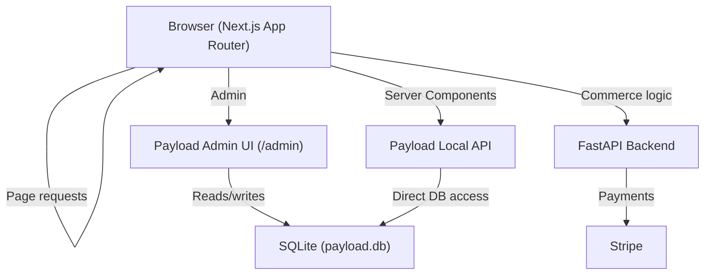

# Design Document — Payload CMS v3 Migration

## Overview

This document covers the technical design for migrating the content layer of `apps/web` from Sanity CMS to Payload CMS v3. Payload runs as a Next.js plugin inside the existing `apps/web` application — no new service, no separate port. The admin panel is available at `/admin`. Content is persisted to a local SQLite file (`payload.db`). The FastAPI backend, all UI components, Zustand stores, and page routes are unaffected structurally; only their data-fetching imports change.

---

## Architecture



### Key Decisions

- **Embedded in Next.js**: Payload v3 uses `withPayload()` to wrap `next.config.ts` and adds its own route handlers inside `app/(payload)/`. This is the official Payload v3 Next.js integration pattern.
- **Local API only**: Server components call `getPayload({ config })` directly — no HTTP, no REST, no GraphQL. This is faster than Sanity's CDN fetches and works offline.
- **SQLite for local dev**: Zero infrastructure. `payload.db` is auto-created. For production, swap the adapter to `@payloadcms/db-postgres` with one config change.
- **Same function signatures**: `lib/payload/queries.ts` exports the same function names and return shapes as `lib/sanity/queries.ts`. Page-level imports change from `@/lib/sanity/queries` to `@/lib/payload/queries` — nothing else.
- **Image uploads**: Files stored in `public/media/`. No external image CDN needed locally. `getImageUrl()` returns `/media/[filename]` which `next/image` serves directly.

---

## Components and Interfaces

### New Files

| File | Purpose |
|---|---|
| `apps/web/payload.config.ts` | Root Payload config: adapter, collections, editor, admin |
| `apps/web/lib/payload/queries.ts` | Query layer wrapping Payload Local API |
| `apps/web/lib/payload/image.ts` | `getImageUrl()` helper for Payload upload shapes |
| `apps/web/app/(payload)/admin/[[...segments]]/page.tsx` | Payload admin catch-all route |
| `apps/web/app/(payload)/admin/[[...segments]]/not-found.tsx` | Payload admin 404 |
| `apps/web/app/(payload)/api/[...slug]/route.ts` | Payload REST/upload API routes |
| `apps/web/components/ui/rich-text.tsx` | Lexical rich text renderer component |
| `apps/web/collections/Products.ts` | Product collection definition |
| `apps/web/collections/Categories.ts` | Category collection definition |
| `apps/web/collections/Collections.ts` | Collection collection definition |
| `apps/web/collections/Policies.ts` | Policy collection definition |
| `apps/web/collections/Media.ts` | Media/uploads collection definition |
| `apps/web/globals/HomepageSettings.ts` | Homepage settings global |

### Modified Files

| File | Change |
|---|---|
| `apps/web/next.config.ts` | Wrap with `withPayload()` |
| `apps/web/tsconfig.json` | Add `payload.config.ts` and collections to include paths if needed |
| `apps/web/app/page.tsx` | Import from `lib/payload/queries` and `lib/payload/image` |
| `apps/web/app/products/[slug]/page.tsx` | Import from `lib/payload/queries` and `lib/payload/image` |
| `apps/web/app/collections/page.tsx` | Import from `lib/payload/queries` |
| `apps/web/app/collections/[slug]/page.tsx` | Import from `lib/payload/queries` and `lib/payload/image` |
| `apps/web/app/policies/[slug]/page.tsx` | Import from `lib/payload/queries`, render with `RichText` |
| `apps/web/app/about/page.tsx` | Update data source reference |
| `apps/web/.env.local.example` | Replace Sanity vars with `PAYLOAD_SECRET` |
| `apps/web/.gitignore` | Add `payload.db` and `public/media/` |

### Deleted Files/Directories

| Path | Reason |
|---|---|
| `apps/web/sanity/` | Sanity studio — no longer needed |
| `apps/web/lib/sanity/` | Sanity client, queries, image builder |

---

## Data Models

### Payload Collection: Products

```ts
// apps/web/collections/Products.ts
{
  slug: 'products',
  fields: [
    { name: 'title',          type: 'text',       required: true },
    { name: 'slug',           type: 'text',       required: true, unique: true },  // auto-populated
    { name: 'price',          type: 'number',     required: true },
    { name: 'compareAtPrice', type: 'number' },
    { name: 'images',         type: 'array',      fields: [{ name: 'image', type: 'upload', relationTo: 'media' }] },
    { name: 'category',       type: 'relationship', relationTo: 'categories' },
    { name: 'collection',     type: 'relationship', relationTo: 'collections' },
    { name: 'materials',      type: 'array',      fields: [{ name: 'material', type: 'text' }] },
    { name: 'options',        type: 'array',      fields: [{ name: 'name', type: 'text' }, { name: 'values', type: 'array', fields: [{ name: 'value', type: 'text' }] }] },
    { name: 'description',    type: 'richText' },
    { name: 'craftsmanship',  type: 'richText' },
    { name: 'isNew',          type: 'checkbox',   defaultValue: false },
    { name: 'isFeatured',     type: 'checkbox',   defaultValue: false },
    { name: 'inStock',        type: 'checkbox',   defaultValue: true },
  ]
}
```

### Payload Collection: Categories

```ts
{
  slug: 'categories',
  fields: [
    { name: 'title', type: 'text',     required: true },
    { name: 'slug',  type: 'text',     required: true, unique: true },
    { name: 'image', type: 'upload',   relationTo: 'media' },
  ]
}
```

### Payload Collection: Collections

```ts
{
  slug: 'collections',
  fields: [
    { name: 'title',       type: 'text',         required: true },
    { name: 'slug',        type: 'text',         required: true, unique: true },
    { name: 'heroImage',   type: 'upload',       relationTo: 'media' },
    { name: 'description', type: 'textarea' },
    { name: 'products',    type: 'relationship', relationTo: 'products', hasMany: true },
  ]
}
```

### Payload Global: HomepageSettings

```ts
{
  slug: 'homepage-settings',
  fields: [
    {
      name: 'hero', type: 'group', fields: [
        { name: 'headline',  type: 'text' },
        { name: 'subline',   type: 'text' },
        { name: 'ctaLabel',  type: 'text' },
        { name: 'ctaHref',   type: 'text' },
        { name: 'image',     type: 'upload', relationTo: 'media' },
      ]
    },
    { name: 'featuredCategories', type: 'relationship', relationTo: 'categories',  hasMany: true },
    { name: 'signatureProducts',  type: 'relationship', relationTo: 'products',    hasMany: true },
    {
      name: 'campaignBanner', type: 'group', fields: [
        { name: 'image',    type: 'upload', relationTo: 'media' },
        { name: 'headline', type: 'text' },
        { name: 'ctaLabel', type: 'text' },
        { name: 'ctaHref',  type: 'text' },
      ]
    },
    { name: 'featuredProducts',   type: 'relationship', relationTo: 'products',    hasMany: true },
    {
      name: 'brandStory', type: 'group', fields: [
        { name: 'image',    type: 'upload',   relationTo: 'media' },
        { name: 'headline', type: 'text' },
        { name: 'body',     type: 'richText' },
      ]
    },
    { name: 'newsletterHeadline', type: 'text' },
  ]
}
```

### Payload Collection: Policies

```ts
{
  slug: 'policies',
  fields: [
    { name: 'title', type: 'text',     required: true },
    { name: 'slug',  type: 'text',     required: true, unique: true },
    { name: 'body',  type: 'richText' },
  ]
}
```

### Payload Collection: Media

```ts
{
  slug: 'media',
  upload: {
    staticDir: 'public/media',
    staticURL: '/media',
  },
  fields: [
    { name: 'alt', type: 'text' }
  ]
}
```

---

## Query Layer Design

### `lib/payload/queries.ts` — Interface Contract

The query layer wraps Payload's Local API and returns data shaped identically to what the existing pages expect. This minimizes the diff in page files.

```ts
import { getPayload } from 'payload'
import config from '@payload-config'

// Shared image shape (what components receive)
type PayloadImage = {
  url: string
  alt?: string
}

// Product card shape (matches existing Sanity ProductCard interface)
type ProductCard = {
  id: string
  title: string
  slug: string
  price: number
  compareAtPrice?: number
  inStock: boolean
  isNew?: boolean
  isFeatured?: boolean
  images: PayloadImage[]
  category?: { title: string; slug: string }
}
```

**Key query implementations:**

```ts
// Homepage settings — uses Payload globals API
export async function getHomepageSettings() {
  const payload = await getPayload({ config })
  const settings = await payload.findGlobal({ slug: 'homepage-settings', depth: 2 })
  return transformHomepageSettings(settings)
}

// Product by slug — uses payload.find() with where filter
export async function getProductBySlug(slug: string) {
  const payload = await getPayload({ config })
  const { docs } = await payload.find({
    collection: 'products',
    where: { slug: { equals: slug } },
    depth: 2,  // populate category, collection, images
    limit: 1,
  })
  return docs[0] ? transformProduct(docs[0]) : null
}

// Collection by slug with products
export async function getCollectionBySlug(slug: string) {
  const payload = await getPayload({ config })
  const { docs } = await payload.find({
    collection: 'collections',
    where: { slug: { equals: slug } },
    depth: 2,
    limit: 1,
  })
  return docs[0] ? transformCollection(docs[0]) : null
}
```

### `lib/payload/image.ts` — Image URL Helper

```ts
// Replaces urlFor() from Sanity
export function getImageUrl(image: { url?: string } | null | undefined): string {
  if (!image?.url) return ''
  // Payload stores relative URLs like '/media/filename.jpg'
  // or absolute URLs depending on config
  return image.url
}
```

---

## Payload Configuration

### `payload.config.ts` — Root Config

```ts
import { buildConfig } from 'payload'
import { sqliteAdapter } from '@payloadcms/db-sqlite'
import { lexicalEditor } from '@payloadcms/richtext-lexical'
import { nextPayloadPlugin } from '@payloadcms/next'
import { Products } from './collections/Products'
import { Categories } from './collections/Categories'
import { Collections } from './collections/Collections'
import { Policies } from './collections/Policies'
import { Media } from './collections/Media'
import { HomepageSettings } from './globals/HomepageSettings'

export default buildConfig({
  secret: process.env.PAYLOAD_SECRET ?? '',
  db: sqliteAdapter({
    client: {
      url: 'file:./payload.db',
    },
  }),
  editor: lexicalEditor({}),
  collections: [Products, Categories, Collections, Policies, Media],
  globals: [HomepageSettings],
  admin: {
    user: 'users',  // built-in users collection
  },
  typescript: {
    outputFile: './payload-types.ts',
  },
})
```

### `next.config.ts` — Wrapped with Payload

```ts
import { withPayload } from '@payloadcms/next'
import type { NextConfig } from 'next'

const nextConfig: NextConfig = {
  // ...existing config
}

export default withPayload(nextConfig)
```

---

## Rich Text Rendering

Payload's Lexical editor stores content as a JSON structure. The `@payloadcms/richtext-lexical` package provides a React renderer.

```tsx
// apps/web/components/ui/rich-text.tsx
import { RichText as PayloadRichText } from '@payloadcms/richtext-lexical/react'

interface Props {
  content: Record<string, unknown>  // Lexical JSON
  className?: string
}

export function RichText({ content, className }: Props) {
  return (
    <div className={className}>
      <PayloadRichText data={content} />
    </div>
  )
}
```

Applied in:
- `app/policies/[slug]/page.tsx` — replace `@portabletext/react` / raw Sanity portable text with `<RichText content={policy.body} />`
- `components/commerce/editorial-accordion.tsx` — product description and craftsmanship fields

---

## Migration Path for Page Routes

Each page changes only its import lines. Data shapes are preserved by the transform functions in `lib/payload/queries.ts`.

### Example: `app/page.tsx`

```diff
- import { getHomepageSettings } from "@/lib/sanity/queries"
- import { urlFor } from "@/lib/sanity/image"
+ import { getHomepageSettings } from "@/lib/payload/queries"
+ import { getImageUrl } from "@/lib/payload/image"

// In component:
- imageUrl={urlFor(hero.image).width(1920).url()}
+ imageUrl={getImageUrl(hero.image)}
```

This pattern repeats for all pages. The `urlFor().width().url()` call is replaced with `getImageUrl()` — since Payload stores pre-uploaded images, server-side image resizing is out of scope for local dev.

---

## Payload App Router Integration

Payload v3 requires specific route files inside `app/(payload)/`:

```
apps/web/app/(payload)/
  admin/
    [[...segments]]/
      page.tsx          ← imports RootPage from @payloadcms/next/views
      not-found.tsx     ← imports NotFoundPage from @payloadcms/next/views
  api/
    [...slug]/
      route.ts          ← imports REST_DELETE, REST_GET, etc. from @payloadcms/next/routes
```

These files are boilerplate generated by `create-payload-app` and copied verbatim per Payload's official docs.

---

## Environment Variables

### `.env.local` (added)
```
PAYLOAD_SECRET=your-random-secret-string-here
```

### `.env.local.example` (updated)
```
# Payload CMS
PAYLOAD_SECRET=your-random-secret-string-here

# FastAPI Backend
NEXT_PUBLIC_API_URL=http://localhost:8000

# Stripe
NEXT_PUBLIC_STRIPE_PUBLISHABLE_KEY=pk_test_...
```

---

## Error Handling

- If `PAYLOAD_SECRET` is missing, Payload throws on startup with a clear message.
- If `payload.db` doesn't exist, Payload creates it automatically on first run.
- Query functions catch errors and return `null` / empty arrays, matching existing behavior in the Sanity query layer.
- If a collection document isn't found, functions return `null` and pages call `notFound()` as they do today.

---

## Testing Strategy

- Manual: Start dev server, visit `/admin`, create first account, create one product, verify it appears on the homepage.
- Type safety: `payload generate:types` produces `payload-types.ts` which TypeScript will validate against collection definitions.
- No automated tests required for this migration — the UI components are unchanged and their existing behavior is tested visually.

---

## Folder Structure (changed files only)

```
apps/web/
├── payload.config.ts          ← NEW: root Payload config
├── payload-types.ts           ← NEW: auto-generated by payload generate:types
├── payload.db                 ← NEW: SQLite database (gitignored)
├── collections/
│   ├── Products.ts            ← NEW
│   ├── Categories.ts          ← NEW
│   ├── Collections.ts         ← NEW
│   ├── Policies.ts            ← NEW
│   └── Media.ts               ← NEW
├── globals/
│   └── HomepageSettings.ts    ← NEW
├── lib/
│   ├── payload/
│   │   ├── queries.ts         ← NEW: replaces lib/sanity/queries.ts
│   │   └── image.ts           ← NEW: replaces lib/sanity/image.ts
│   └── sanity/                ← DELETED after migration
├── components/ui/
│   └── rich-text.tsx          ← NEW: Lexical renderer
├── app/
│   ├── (payload)/             ← NEW: Payload route handlers
│   │   ├── admin/[[...segments]]/page.tsx
│   │   ├── admin/[[...segments]]/not-found.tsx
│   │   └── api/[...slug]/route.ts
│   ├── page.tsx               ← MODIFIED: import source
│   ├── products/[slug]/page.tsx   ← MODIFIED
│   ├── collections/page.tsx       ← MODIFIED
│   ├── collections/[slug]/page.tsx← MODIFIED
│   ├── policies/[slug]/page.tsx   ← MODIFIED
│   └── about/page.tsx             ← MODIFIED
├── next.config.ts             ← MODIFIED: withPayload() wrapper
└── sanity/                    ← DELETED after migration
```
